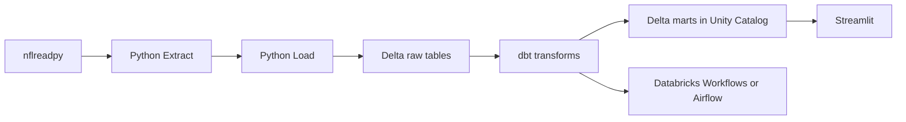

# statline

**Current scope:** Historical NFL player stats and roster data (2000–2024)
**Planned:** Live game ingestion when the 2025 season begins

---

## Objective

Building a data pipeline to support sports modeling and analytics. I have many hobby projects during the NFL season that model and analyze different situations. The problem I run into is that I'm very busy and the data sources I use require a full ETL every time I need fresh data, leaving little time for actual analysis. I also built a Sports App that needed a better way to handle historical data. Statline solves this by building a production-style automated pipeline that handles ingestion, transformation, and storage so the data is always ready.

## Stack

**Data Sources:** nflreadpy (primary) · nflverse · Pro Football Reference (planned secondary)

**Extract:** Python (nflreadpy)

**Load:** Python → Databricks

**Storage:** Delta Lake (Unity Catalog)

**Transform:** dbt (dbt-databricks adapter)

**Orchestration:** Databricks Workflows or Airflow

**Dashboard:** Streamlit

## Architecture

```
nflreadpy → Python extract → Python load → Delta raw → dbt → Delta marts (Unity Catalog) → Streamlit
```



## Data Model

Star schema — two fact tables, three dimension tables.

**Grain:**
- `fact_player_game` — one row per player per game
- `fact_team_game` — one row per team per game

**Dimensions:**
- `dim_player`, `dim_team`, `dim_game`

**Design choices:**
- Wide `fact_player_game` with all box-score stats; position-specific dbt views (e.g. `mart_qb_game`) built on top later
- `dim_player` filtered to columns needed for analytics
- NFL only; historical 2000–2024 first; live ingestion deferred to 2025 season

## Development Setup

- **Environment:** uv + `pyproject.toml` / `uv.lock` — never install packages globally
- **Secrets:** credentials in `.env` only; never committed
- **Git:** feature branches, merge via PR even when solo; `main` stays clean
- **dbt:** project lives inside this repo, not as a standalone repo
- **Docker:** optional — only if running Airflow locally; skip if using Databricks Workflows

**`.gitignore` essentials:**

```
.env
__pycache__/
*.pyc
.venv/
target/
dbt_packages/
logs/
```

Phase checklist with progress tracking lives in [`00_devlog.md`](00_devlog.md).
