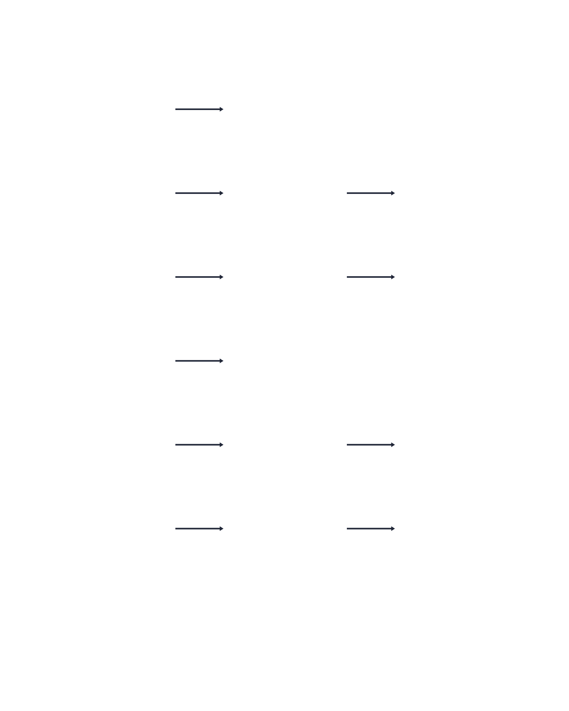

# statline

Local sports data lakehouse. Right now: historical NFL (box scores, schedules, rosters, draft) landed in DuckLake, cleaned in dbt, orchestrated in Dagster, served as a star schema.

**Done:** bronze ingest + silver staging + gold marts + local Dagster  
**Not built yet:** live game feeds, multi-sport  
**Deferred:** live 2025+ in-season ingestion (historical path first)

---

## Why this exists

I burn a lot of time re-pulling and re-shaping public NFL data every season for hobby models and a sports app. Sources are fine; the glue isn't. Statline is the production-style pipeline so the data is already in a clean, queryable place when I need it.

Also a portfolio piece for Data Engineer roles (Indianapolis / Chicago / Austin) — something I can walk through end to end and defend.

## Stack (and the pivot)

Originally scoped for Databricks + Unity Catalog + Delta. The data is one sport and ~25 seasons of box scores — distributed compute was solving a problem I don't have. Pivoted to fully local:

| Piece | Choice |
|--------|--------|
| Extract | Python + `nflreadpy` |
| Load | Python → DuckLake (`lake.raw`) |
| Storage | DuckLake (SQL catalog + Parquet) |
| Transform | dbt + `dbt-duckdb` |
| Orchestration | Dagster (local assets) |
| Env | `uv` + `pyproject.toml` / `uv.lock` |

Planned later: PFR as a secondary source. No cloud scheduler yet — local asset materialization is the orchestration story.

## Pipeline

```
nflreadpy → Python load → lake.raw (bronze)
                       → dbt stg_* (silver)
                       → dbt dim_* / fact_* (gold)
                       → notebooks / sports app (non-live)

         Dagster assets: bronze → silver → gold (local UI)
```

| Layer | Schema / objects | Owner |
|--------|------------------|--------|
| Bronze | `lake.raw.nfl_*` | Python loaders — source-shaped, no star renames |
| Silver | `lake.main_staging.stg_*` | dbt views — clean, rename, key filters |
| Gold | `lake.main_marts.dim_*` / `fact_*` | dbt tables — star schema for app + shared metrics |

dbt prefixes custom schemas with the target schema (`main`), so you see `main_staging` / `main_marts` instead of bare `staging` / `marts`. Same idea as `raw`.

### Asset graph (Dagster)

Medallion groups in the local UI — bronze raw loaders, silver staging, gold marts:



## Data model (gold)

**Facts**

- `fact_player_game` — one row per player per game (wide box score)
- `fact_team_game` — one row per team per game

**Dims**

- `dim_player` — NK `gsis_id` (`player_id` on facts maps here)
- `dim_team` — NK `team_abbr`
- `dim_game` — NK `game_id`

Rosters and draft picks live in silver only for now.

## Repo layout

```
ingestion/           # DuckLake connect + raw loaders
  load/              # load_raw_nfl_*.py
  schemas/           # DDL for lake.raw
orchestration/       # Dagster definitions + assets
  assets/            # raw multi-asset, dagster-dbt
  resources/         # lake path normalization
scripts/             # ingestion-runner.py
statline_dbt/        # dbt project (staging + marts)
docs/images/         # portfolio screenshots / graphs
lake/                # local catalog + parquet (gitignored)
notebooks/           # exploration (not the pipeline)
```

## Setup

**Requirements:** Python ≥ 3.13, [uv](https://docs.astral.sh/uv/)

```bash
git clone <repo>
cd Statline
uv sync
cp .env.example .env
```

`.env` (from `.env.example`):

```bash
LAKE_CATALOG_PATH=lake/metadata.ducklake
LAKE_DATA_PATH=lake/data
```

Paths are **relative to the repo root** for CLI ingest/dbt. Always run from the repo root, not from `statline_dbt/`. The catalog stores the data path as `lake/data/`.

**Fish shell** (dbt does not load `.env` itself — export into the session):

```fish
cd /path/to/Statline
set -x LAKE_CATALOG_PATH lake/metadata.ducklake
set -x LAKE_DATA_PATH lake/data
```

**Bash:**

```bash
export LAKE_CATALOG_PATH=lake/metadata.ducklake
export LAKE_DATA_PATH=lake/data
# or: set -a && source .env && set +a
```

### Initialize empty lake (first time)

```bash
uv run python -m ingestion.ducklake
```

### Load raw (bronze)

```bash
# all loaders (current-season defaults on season-scoped tables)
uv run python scripts/ingestion-runner.py

# or one table
uv run python ingestion/load/load_raw_nfl_teams.py
```

Season-scoped loaders currently default to `nflreadpy.get_current_season()`. Historical backfill was done in development; parameterized seasons are a follow-up so a fresh clone can reproduce 2000–2024 cleanly.

### Transform (silver + gold)

```bash
uv run dbt debug --project-dir statline_dbt --profiles-dir statline_dbt
uv run dbt build --project-dir statline_dbt --profiles-dir statline_dbt
```

`statline_dbt/profiles.yml` uses `threads: 1` — parallel dbt materializations were flaky against local DuckLake; single-thread is the reliable demo path.

### Orchestrate (Dagster, local)

From **repo root**:

```fish
mkdir -p .dagster_home
set -x DAGSTER_HOME (pwd)/.dagster_home
set -x LAKE_CATALOG_PATH lake/metadata.ducklake
set -x LAKE_DATA_PATH lake/data
uv run dagster dev -m orchestration.definitions
```

Open http://localhost:3000. Materialize bronze (`raw/*`), then silver/gold dbt assets (or the full graph).

- Definitions: `orchestration/definitions.py`
- Bronze: multi-asset wrappers around existing `load_raw_nfl_*.py` (season config on seasonal tables)
- Silver/gold: `dagster-dbt` from the dbt manifest; groups `bronze` / `silver` / `gold`
- Path note: dagster-dbt runs with cwd = `statline_dbt/`. Orchestration normalizes lake paths and dbt uses `override_data_path` so DuckLake parquet IO still hits the monorepo `lake/` tree.

### Query

Attach the same lake (DuckDB CLI, notebook, or app) and read:

- Exploration / flexible analysis → `main_staging.stg_*`
- App + “official” metrics → `main_marts.dim_*` / `fact_*`

## Development notes

- **uv only** for Python deps — no global `pip install`
- **Feature branches + PRs** even solo; `main` stays merge-only
- **Never commit** `.env`, `lake/`, `*.duckdb`, dbt `target/`, `.dagster_home/`
- Running devlog: `devlog/` (local, gitignored)

## Status

| Phase | State |
|--------|--------|
| Setup + DuckLake | Done |
| Bronze ingest (`nfl_*` raw) | Done |
| dbt silver (`stg_*`) | Done |
| dbt gold (star marts) | Done |
| Dagster (local assets) | Done |
| Loader season params / backfill UX | Next |
| Live feeds / multi-sport | Later |
