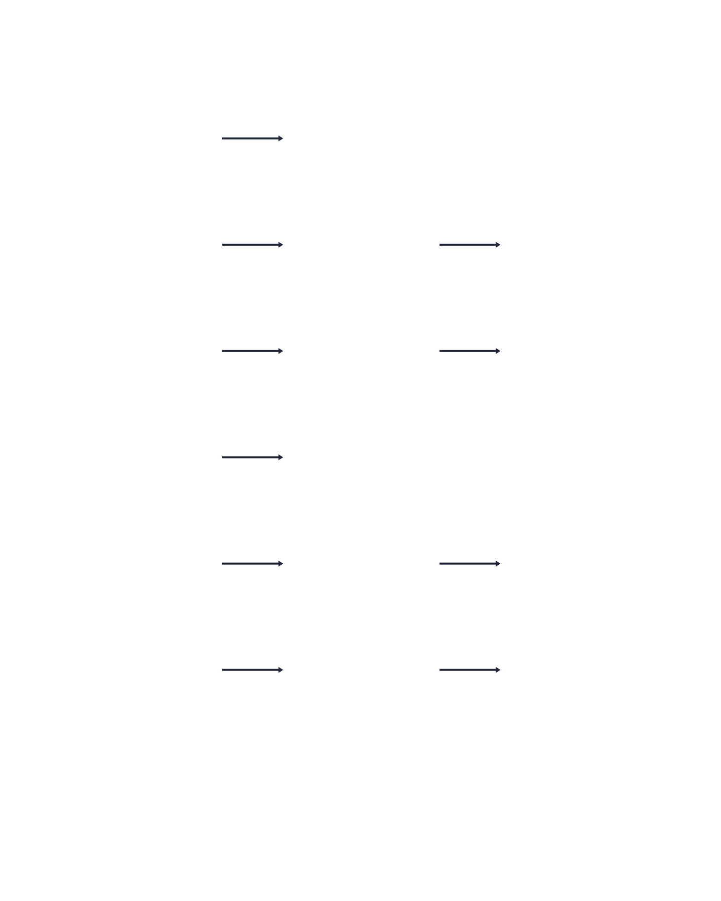

# Statline

Local NFL lakehouse. Public box scores, schedules, rosters, and draft picks land in DuckLake, are cleaned and tested in dbt, and run in Dagster as bronze → silver → gold. Gold is a star schema for analysis and a downstream sports app.

**Built:** bronze ingest, silver staging, gold marts, local Dagster assets, `nfl_weekly_refresh`  
**Ahead:** live game feeds, multi-sport, a one-command 2000–2024 backfill

The Tuesday job runs while local `dagster dev` is up. A fresh clone loads the current season. Older seasons are one year per command.

## Quick start

Python ≥ 3.13 and [uv](https://docs.astral.sh/uv/getting-started/installation/). [Go 1.27.1](https://go.dev/dl/) (matches `go.work`) is for the parquet export. The [DuckDB CLI](https://duckdb.org/install/) is for ad-hoc queries. Bootstrap needs uv only.

From the repo root:

```bash
git clone https://github.com/willvernon/Statline.git
cd Statline
uv run python scripts/setup.py
```

`scripts/setup.py` copies `.env` from `.env.example`, creates `.dagster_home`, inits DuckLake, loads **current-season** bronze, and `dbt build`s silver and gold. It prints the `DAGSTER_HOME` export for your shell. Missing `uv` exits with the download links above.

Open Dagster:

```bash
export DAGSTER_HOME="$PWD/.dagster_home"
uv run dagster dev -m orchestration.definitions
```

http://localhost:3000 — materialize the graph, or launch `nfl_weekly_refresh`.

| Shell    | `DAGSTER_HOME`                                              |
| -------- | ----------------------------------------------------------- |
| bash/zsh | `export DAGSTER_HOME="$PWD/.dagster_home"`                  |
| fish     | `set -x DAGSTER_HOME (pwd)/.dagster_home`                   |
| nushell  | `$env.DAGSTER_HOME = ($env.PWD \| path join ".dagster_home")` |

`DAGSTER_HOME` is a shell export (absolute path). Leave it unset and each `dagster dev` gets a fresh `.tmp_dagster_home_*`. `.env` holds lake paths only, relative to the repo root:

```bash
LAKE_CATALOG_PATH=lake/metadata.ducklake
LAKE_DATA_PATH=lake/data
```

Run commands from the repo root. Python loaders and Dagster read `.env`. A hand-run `dbt` needs the same paths exported (`set -a && source .env && set +a`). Setup already exports them for its own `dbt build`.

Load another season, rebuild, or copy one gold mart out:

```bash
uv run python scripts/ingestion_runner.py 2024
uv run dbt build --project-dir statline_dbt --profiles-dir statline_dbt
go run ./cli -dataMart fact_player_game -dest "$HOME/Downloads/fact_player_game.parquet"
```

A year reloads that season for stats, schedules, rosters, and draft. Teams and players are full snapshots. `-dest` is a `.parquet` file; use `$HOME` or an absolute path.

Step-by-step, without `setup.py`: `uv sync`, `cp .env.example .env`, then [Run](#run).

## Why this exists

Each NFL week I was re-extracting and reshaping the same public data for models, analysis, and a sports app. Statline keeps that data clean and queryable. It is also the project I walk through for Data Engineer roles in Indianapolis, Chicago, and Austin.

## Stack

Originally scoped for Databricks + Unity Catalog + Delta. One sport and about 25 seasons of box scores does not need distributed compute, so the stack is fully local.

| Piece         | Choice                           |
| ------------- | -------------------------------- |
| Extract       | Python + `nflreadpy`             |
| Load          | Python → DuckLake (`lake.raw`)   |
| Storage       | DuckLake (SQL catalog + Parquet) |
| Transform     | dbt + `dbt-duckdb`               |
| Orchestration | Dagster (local job + schedule)   |
| Env           | `uv` + `pyproject.toml`          |

## Pipeline

```
nflreadpy → Python load → lake.raw (bronze)
                       → dbt stg_* (silver)
                       → dbt dim_* / fact_* (gold)
                       → notebooks / sports app

         Dagster: bronze → silver → gold
         job: nfl_weekly_refresh
```

| Layer  | Schema / objects                   | Owner                                            |
| ------ | ---------------------------------- | ------------------------------------------------ |
| Bronze | `lake.raw.nfl_*`                   | Python loaders. Source-shaped, no star renames. |
| Silver | `lake.main_staging.stg_*`          | dbt views. Clean, rename, key filters.           |
| Gold   | `lake.main_marts.dim_*` / `fact_*` | dbt tables. Star schema for app + shared metrics.|

dbt prefixes custom schemas with the target schema (`main`), so the names are `main_staging` and `main_marts`.



## Data model (gold)

**Facts**

- `fact_player_game`: one row per player per game (wide box score)
- `fact_team_game`: one row per team per game

**Dims**

- `dim_player`: natural key `gsis_id` (`player_id` on facts maps here)
- `dim_team`: natural key `team_abbr`
- `dim_game`: natural key `game_id`

Rosters and draft picks stay in silver for now.

## Repo layout

```
ingestion/              # DuckLake connect + raw loaders
  load/                 # load_raw_nfl_*.py
  schemas/              # DDL for lake.raw
orchestration/          # Dagster definitions + assets
  assets/               # raw multi-asset, dagster-dbt
  resources/            # lake path normalization
scripts/                # setup.py (clone bootstrap), ingestion_runner.py
cli/                    # Go CLI: COPY gold marts to parquet
statline_dbt/           # dbt project (staging + marts)
docs/                   # design notes + graphs
  multi-sport-data.md   # how more leagues would land (no code yet)
lake/                   # local catalog + parquet (gitignored)
notebooks/              # exploration (not the pipeline)
```

## Run

Same work as `scripts/setup.py`, one command at a time. Repo root.

### Initialize the lake

```bash
uv run python -m ingestion.ducklake
```

### Load bronze

```bash
uv run python scripts/ingestion_runner.py            # current season
uv run python scripts/ingestion_runner.py 2024       # one season
uv run python ingestion/load/load_raw_nfl_teams.py   # one table; current season
```

Individual loaders have no year flag. There is no 2000–2024 loop.

### Transform (silver + gold)

```bash
set -a && source .env && set +a
uv run dbt debug --project-dir statline_dbt --profiles-dir statline_dbt
uv run dbt build --project-dir statline_dbt --profiles-dir statline_dbt
```

Fish: `set -x LAKE_CATALOG_PATH lake/metadata.ducklake` and `set -x LAKE_DATA_PATH lake/data`.

`dbt build` runs the `unique` and `not_null` key tests in `statline_dbt/models/*/schema.yml`. `statline_dbt/profiles.yml` sets `threads: 1`. Parallel materializations were flaky against local DuckLake.

### Orchestrate (Dagster)

```bash
mkdir -p .dagster_home
export DAGSTER_HOME="$PWD/.dagster_home"
uv run dagster dev -m orchestration.definitions
```

Fish: `set -x DAGSTER_HOME (pwd)/.dagster_home`  
Nushell: `$env.DAGSTER_HOME = ($env.PWD | path join ".dagster_home")`

- Launch `nfl_weekly_refresh`, or materialize bronze (`raw/*`) then silver/gold. Same graph.
- `nfl_weekly_schedule` (Tue 8am Indianapolis, `orchestration/definitions.py`) starts Stopped. Turn it on under Automation. It fires only while this process is running.
- Bronze assets call `load_raw_nfl_*.py`. Silver and gold come from `dagster-dbt` (groups `bronze` / `silver` / `gold`). dbt’s cwd is `statline_dbt/`; orchestration makes lake paths absolute and sets `override_data_path` so parquet stays under repo `lake/`.

### Export gold (Go CLI)

Gold marts already exist (`scripts/setup.py`, `dbt build`, or Dagster). From the repo root, Go 1.27.1 attaches the local lake and `COPY`s one mart to parquet.

```bash
go run ./cli -dataMart fact_player_game -dest "$HOME/Downloads/fact_player_game.parquet"
```

`-dataMart`: `fact_player_game` (default), `fact_team_game`, `dim_player`, `dim_team`, `dim_game`.

```bash
go build -o statline-export ./cli
./statline-export -dataMart dim_team -dest "$HOME/Downloads/dim_team.parquet"
```

Nushell dest: `($env.HOME | path join "Downloads" "fact_player_game.parquet")`

### Query

Attach the same lake (DuckDB CLI, notebook, or app):

- Exploration: `main_staging.stg_*`
- App and shared metrics: `main_marts.dim_*` / `fact_*`

## Development notes

- **uv only** for Python deps. No global `pip install`.
- **Feature branches + PRs** even solo. `main` stays merge-only.
- **Never commit** `.env`, `lake/`, `*.duckdb`, dbt `target/`, `.dagster_home/`
- Running notes live in `devlog/` (local, gitignored)
- Working list: `todo.md` (local, gitignored)

## Status

| Phase                             | State                                |
| --------------------------------- | ------------------------------------ |
| Setup + DuckLake                  | Done                                 |
| Bronze ingest (`nfl_*` raw)       | Done                                 |
| dbt silver (`stg_*`)              | Done                                 |
| dbt gold (star marts)             | Done                                 |
| dbt tests (`unique` / `not_null`) | Done                                 |
| Dagster assets + weekly job       | Done                                 |
| One-command historical load       | Next (runner takes one season today) |
| Live feeds / multi-sport          | Next. Map: `docs/multi-sport-data.md` |
